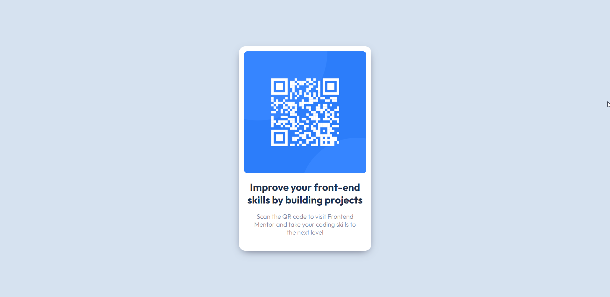

# Frontend Mentor - QR code component solution

This is a solution to the [QR code component challenge on Frontend Mentor](https://www.frontendmentor.io/challenges/qr-code-component-iux_sIO_H). Frontend Mentor challenges help you improve your coding skills by building realistic projects. 

## Table of contents

- [Overview](#overview)
  - [Screenshot](#screenshot)
  - [Links](#links)
- [My process](#my-process)
  - [Built with](#built-with)
  - [What I learned](#what-i-learned)
  - [Useful resources](#useful-resources)
- [Author](#author)
- [Acknowledgments](#acknowledgments)


## Overview

### Screenshot



### Links

- Solution URL: [Github](https://github.com/ElPioterro/qr-code-component-main)
- Live Site URL: [Vercel](https://qr-code-component-main.vercel.app/)

## My process

### Built with

- Semantic HTML5 markup
- CSS custom properties
- Flexbox

### What I learned

```css
.card{
    max-width:24rem;
    (...)
}
```

```css
body{
    min-height: 100vh;
    display: grid;
    place-content: center;
}
```
```css
p{ 
    margin: 0px 14px 15px;
}
```

### Useful resources

- [Paddings!](https://developer.mozilla.org/en-US/docs/Web/CSS/padding) - This helped me with padding syntax.
- [Landmark on page content](https://dequeuniversity.com/rules/axe/4.3/region?application=axeAPI) - This is an amazing article which helped me finally understand why do i need main, header, footer etc. in my project. I'd recommend it to anyone how is still writing HTML with only div's.
- [Box Shadow Generator](https://cssgenerator.pl/box-shadow-generator/) - This is an amazing tool for fast making box-shadow.

## Author

- Frontend Mentor - [@ElPioterro](https://www.frontendmentor.io/profile/ElPioterro)


## Acknowledgments

Huge thanks to [@vcarames](https://www.frontendmentor.io/profile/vcarames) and [@MelvinAguilar](https://www.frontendmentor.io/profile/MelvinAguilar) from [frontendmentor.io](https://www.frontendmentor.io)! 💎

They commented on someone's/mine solution and it really helped me improve my code. 🥳